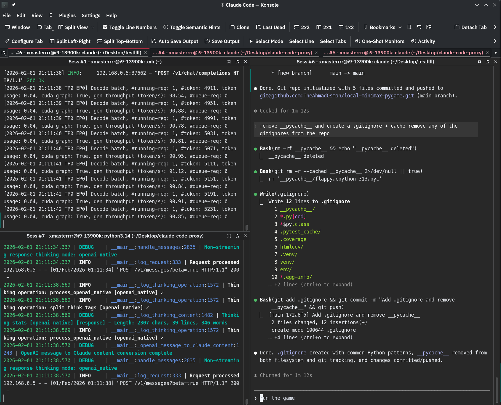
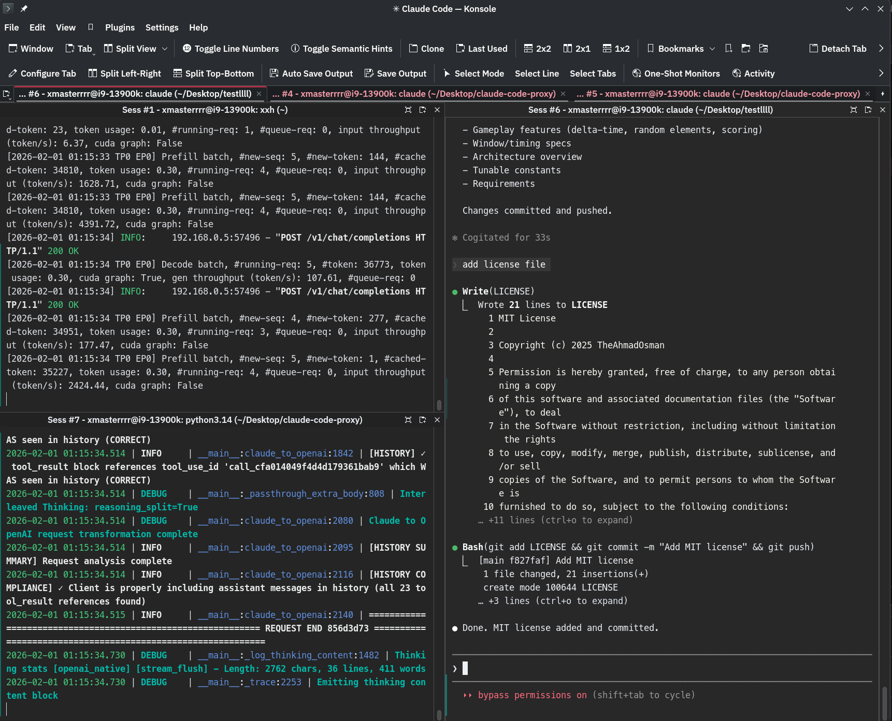

# local-minimax-pygame

A Flappy Bird clone showcasing local LLM inference capabilities with **MiniMax-M2.1** (BF16/INT4-AWQ quantization) running locally on multiple GPUs. Built with pygame - no external assets required.

## MiniMax-M2.1 Local Inference

This project demonstrates running the MiniMax-M2.1 model locally with aggressive quantization:

- Model: MiniMax-M2.1
- Quantization: BF16 and INT4-AWQ
- Hardware: 8x NVIDIA RTX 3090 GPUs
- Setup: Running entirely on local hardware (no API calls)





### AI Cluster

This project was built and tested on a home AI cluster with local MiniMax-M2.1 inference:

- **GPUs**: 14x NVIDIA RTX 3090s (24GB each)
- **Interconnect**: Gen 4 PCIe x8, all GPUs NVLinked
- **Inference**: Full local MiniMax-M2.1 model running without any API calls
- **Quantization**: INT4-AWQ for efficient multi-GPU inference

[Watch the full build + run demo](https://x.com/TheAhmadOsman/status/2017320051980808695)

[](https://x.com/TheAhmadOsman/status/2017320051980808695)

## Installation

```bash
# Create virtual environment and install pygame
uv venv && uv pip install pygame
```

## Running the Game

```bash
uv run python flappy.py
```

## Controls

| Key | Action |
|-----|--------|
| SPACE | Start game / Flap / Restart |
| Q / ESC | Quit immediately |

## Game States

1. **READY** - Bird is static, centered. Press SPACE to start.
2. **PLAYING** - Gravity applies, pipes spawn and move left. Press SPACE to flap.
3. **GAME_OVER** - Game frozen. Shows Score, Best Score. Press SPACE to restart.

## Gameplay Features

- **Delta-time physics** - Consistent 60 FPS gameplay across hardware
- **Random bird** - Shape (square/circle/triangle) and dark color randomized each game
- **Random ground color** - Dark brown or yellow, selected each game
- **Per-pipe colors** - Each pipe pair randomly colored (green, brown, or gray)
- **Playable gaps** - Randomized pipe gaps (150-200px) with randomized spawn timing
- **Score tracking** - Current score and session-best score persist in memory

## Window & Timing

- Resolution: 480x640 pixels
- Target: 60 FPS
- All physics use delta-time for frame-rate independence

## Architecture

```
flappy.py
├── Constants                # All tunable values (physics, colors, dimensions)
├── Bird class             # Player entity with gravity, flap, rendering
├── PipePair class        # Top/bottom pipe generation, collision, scoring
└── Game class            # Main loop, state machine, input handling
```

## Configuration (Tunable Constants)

```python
GRAVITY = 1500              # Downward acceleration (pixels/s^2)
FLAP_STRENGTH = -400       # Upward velocity on flap (pixels/s)
MAX_VELOCITY = 500         # Clamped velocity limit
PIPE_SPEED = 250           # Horizontal pipe movement speed
PIPE_GAP_MIN = 150         # Minimum gap between pipes
PIPE_GAP_MAX = 200         # Maximum gap between pipes
PIPE_SPAWN_MIN = 1.5       # Min seconds between pipe spawns
PIPE_SPAWN_MAX = 2.5       # Max seconds between pipe spawns
GROUND_HEIGHT = 80         # Ground band height
FPS = 60                   # Target frames per second
```

## Requirements

- Python 3.13+
- pygame 2.6.1+

## License

MIT